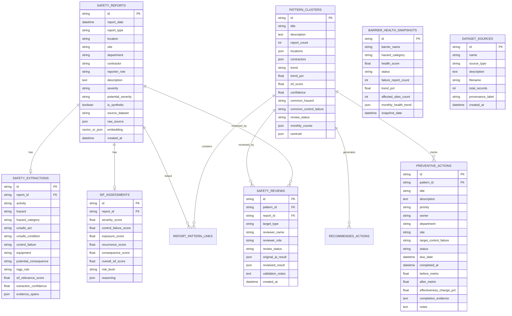

# Database Architecture: SIF Sentinel

SIF Sentinel supports a dual-target database architecture:
1. **Local Development / Offline Demonstration:** SQLite via SQLAlchemy with JSON-serialized embedding storage.
2. **Enterprise Production Deployment:** PostgreSQL with the `pgvector` extension for hardware-accelerated nearest-neighbor vector search.

---

## 1. Architecture Flow

### Local Environment Flow
```
[Browser Client]
       │
       ▼ (HTTP / JSON API)
[Next.js 16 App Router (Port 3000)]
       │
       ▼ (REST API)
[FastAPI Backend (Port 8000)]
       │
       ▼ (SQLAlchemy 2.0 ORM)
[SQLite Local Database: backend/data/sifsentinel.db]
```

### Production Environment Target Flow
```
[Browser Client]
       │
       ▼ (HTTPS / WSS)
[Next.js 16 Frontend (Edge / Vercel / Node)]
       │
       ▼ (REST API / Bearer Auth)
[FastAPI Production Service (Containerized)]
       │
       ▼ (SQLAlchemy 2.0 + psycopg2)
[PostgreSQL 16+ with pgvector Extension (Vector(384) Index)]
```

---

## 2. Table Schema & Relational Model



---

## 3. Database Migration & Initialization

- Database tables are defined in [`backend/app/models/database.py`](file:///d:/Startups/SIF-Sentinel/backend/app/models/database.py) using SQLAlchemy declarative models.
- Database engine initialization is managed by [`backend/app/db/session.py`](file:///d:/Startups/SIF-Sentinel/backend/app/db/session.py).
- Tables are created automatically on startup via `init_db()`.
- To re-verify database state at any time:
  ```powershell
  python scripts/audit_database.py
  ```
