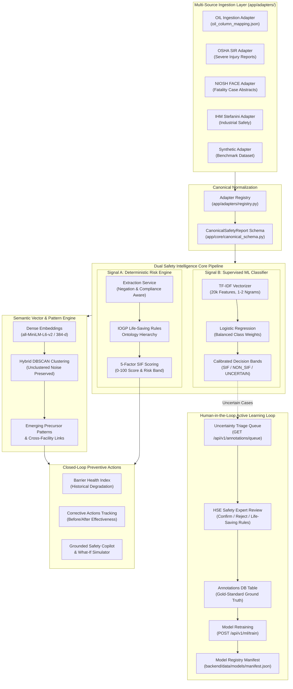
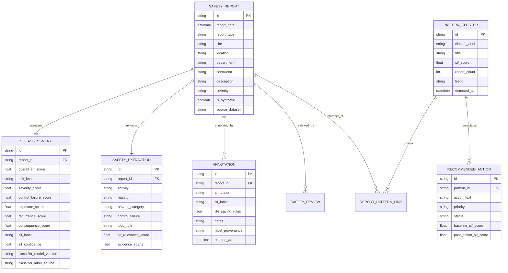

# SIF Sentinel — Post-Merge System Architecture Reference

**Project:** SIH26165 — AI/NLP Engine to Detect SIF Precursors in Safety Reports  
**Repository:** `D:\Startups\SIF-Sentinel`  
**Architecture Paradigm:** Dual Safety Intelligence (Heuristic Risk Engine + Supervised Text Classifier + Active Learning)

---

## 1. End-to-End System Architecture



---

## 2. Component Directory Structure

```
D:\Startups\SIF-Sentinel\
├── backend/
│   ├── app/
│   │   ├── adapters/               # Multi-source ingestion layer
│   │   │   ├── base.py             # Abstract adapter contract
│   │   │   ├── io_utils.py         # CSV, XLSX, XLS, JSON parser
│   │   │   ├── oil.py              # Zero-code JSON-mapped OIL adapter
│   │   │   ├── oil_column_mapping.json # Configurable OIL header mapping
│   │   │   ├── osha.py             # OSHA SIR adapter
│   │   │   ├── niosh.py            # NIOSH FACE adapter
│   │   │   ├── ihm.py              # IHM Stefanini adapter
│   │   │   ├── synthetic.py        # SIF Sentinel synthetic adapter
│   │   │   └── registry.py         # Adapter factory and lookup
│   │   ├── api/v1/
│   │   │   ├── endpoints/
│   │   │   │   ├── auth.py         # Authentication & token endpoints
│   │   │   │   ├── reports.py      # Telemetry CRUD & upload routes
│   │   │   │   ├── ml.py           # Model registry & training routes
│   │   │   │   ├── annotations.py  # Active learning queue & export
│   │   │   │   ├── patterns.py     # Discovered precursor clusters
│   │   │   │   ├── actions.py      # Preventive actions
│   │   │   │   ├── threew.py       # 3W sensor ML inference
│   │   │   │   ├── oisd.py         # OISD case study endpoints
│   │   │   │   └── bsee.py         # BSEE incident analytics
│   │   │   └── routers.py          # Master API router mounting
│   │   ├── core/
│   │   │   ├── config.py           # Application settings & constants
│   │   │   ├── canonical_schema.py # Pydantic canonical report schema
│   │   │   └── security.py         # Passlib bcrypt & RBAC require_role
│   │   ├── db/
│   │   │   └── session.py          # SQLAlchemy engine & SQLite init
│   │   ├── ml/                     # Supervised SIF text classification
│   │   │   ├── schema.py           # SIFPrediction & EvalMetrics dataclasses
│   │   │   ├── base.py             # Base classifier & thresholding
│   │   │   ├── labeling.py         # Weak bootstrap labeling generator
│   │   │   ├── model_logreg.py     # TF-IDF + Logistic Regression baseline
│   │   │   ├── model_xgboost.py    # TF-IDF + XGBoost comparator
│   │   │   ├── evaluate.py         # Metrics & confusion matrix harness
│   │   │   ├── registry.py         # Manifest manager & artifact loader
│   │   │   ├── train.py            # Temporal train/eval split training
│   │   │   └── predict_service.py  # Fault-tolerant inference service
│   │   ├── models/
│   │   │   ├── database.py         # SQLAlchemy ORM entity models
│   │   │   └── schemas.py          # Pydantic request/response schemas
│   │   ├── services/
│   │   │   ├── risk_engine.py      # Deterministic 5-factor scoring
│   │   │   ├── extraction_service.py # Negation-aware NLP extraction
│   │   │   ├── embedding_service.py  # MiniLM semantic embeddings
│   │   │   ├── pattern_engine.py   # Category-first DBSCAN clustering
│   │   │   ├── pipeline.py         # Ingestion orchestration
│   │   │   ├── oisd_service.py     # OISD PDF case studies parser
│   │   │   └── bsee_service.py     # BSEE offshore incident analytics
│   │   └── threew/                 # Petrobras 3W sensor ML module
│   │       ├── data_loader.py      # Parquet instance discovery & loader
│   │       └── feature_extractor.py# Statistical time-series featurizer
│   ├── data/
│   │   ├── sifsentinel.db          # SQLite relational database
│   │   └── models/
│   │       ├── manifest.json       # Versioned model registry manifest
│   │       ├── tfidf_logreg-*.joblib # Active SIF text classifier artifact
│   │       ├── threew_rf_model.joblib # Active 3W sensor Random Forest model
│   │       └── threew_split_metadata.json # 3W instance split metadata
│   └── tests/                      # 44 automated backend pytest tests
│       ├── test_adapters.py        # Ingestion adapter tests
│       ├── test_ml_classifier.py   # ML classifier & evaluation tests
│       ├── test_annotations_rbac.py# Active learning & RBAC tests
│       ├── test_sif_sentinel.py    # Core NLP, risk engine, pipeline tests
│       ├── test_threew_module.py   # 3W sensor ML tests
│       └── test_oisd_bsee.py       # OISD & BSEE tests
│
├── frontend/                       # Next.js 16 Web Application
│   ├── app/
│   │   ├── dashboard/              # Command Center
│   │   ├── review-queue/           # AI Active Learning Review Queue
│   │   ├── reports/                # Telemetry feed & analyze
│   │   │   ├── [id]/               # Report detail with Dual Signals
│   │   │   ├── analyze/            # Interactive Ad-Hoc Analyzer
│   │   │   └── upload/             # File ingestion portal
│   │   ├── patterns/               # Emerging precursor clusters
│   │   ├── barrier-health/         # Barrier Health Index
│   │   ├── actions/                # Preventive Actions tracker
│   │   ├── oil-well-intelligence/  # 3W sensor ML intelligence
│   │   └── offshore-analytics/     # BSEE & OISD analytics
│   ├── components/                 # AppSidebar, AppHeader, Shared UI
│   └── lib/
│       ├── api.ts                  # Typed API client
│       └── utils.ts                # Formatting and color helpers
│
└── docs/                           # Documentation & Audit Reports
    ├── POST_MERGE_SYSTEM_INVENTORY.md
    ├── POST_MERGE_VERIFICATION_REPORT.md
    ├── POST_MERGE_BEGINNER_TEST_GUIDE.md
    ├── POST_MERGE_ARCHITECTURE.md
    ├── MERGED_ARCHITECTURE.md
    └── MERGE_AND_ML_INTEGRATION_REPORT.md
```

---

## 3. Database Schema Overview


