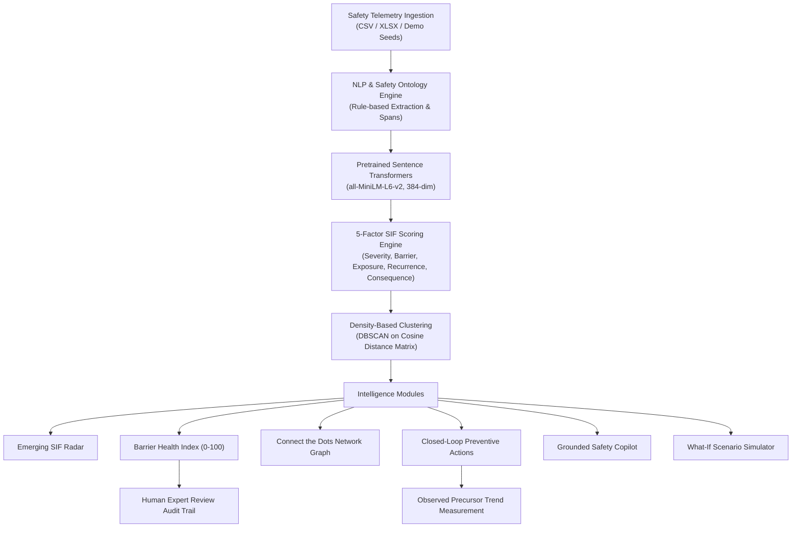

# Technical Architecture: SIF Sentinel

SIF Sentinel is an explainable safety intelligence system that connects thousands of differently worded safety observations (Unsafe Acts, Unsafe Conditions, Near Misses) to uncover recurring Serious Injury & Fatality (SIF) precursor patterns, identify repeatedly failing preventive barriers, detect emerging risk, and support human-led preventive action.

---

## 1. System Overview

---

## 2. Technology Stack & Exact Verified Versions

### Backend (Python)
- **Python Version:** `3.11.9 (64-bit AMD64)`
- **FastAPI:** `0.111.0` (High-performance asynchronous REST API)
- **Uvicorn:** `0.30.1` (ASGI Web Server)
- **SQLAlchemy:** `2.0.31` (ORM & Database Abstraction Layer)
- **Pydantic:** `2.7.4` (Data validation and type safety)
- **Scikit-learn:** `1.9.0 / 1.5.x` (DBSCAN density clustering & distance matrix computation)
- **NumPy:** `1.26.4` (Linear algebra, vector cosine similarities, matrix operations)
- **Pandas:** `2.2.2` (Dataset ingestion, profiling, missingness calculation)
- **Sentence-Transformers:** `3.0.1` (Dense semantic embeddings via `all-MiniLM-L6-v2`)
- **Transformers:** `4.43.0` & **PyTorch:** `2.3.1+cpu` (Underlying neural inference runtime)
- **Pytest:** `8.3.4` (Automated integration & unit test suite)

### Frontend (TypeScript / React / Next.js)
- **Next.js:** `16.3.2` (App Router, Turbopack, Server-Side Rendering & Static Generation)
- **React:** `19.2.8` & **React-DOM:** `19.2.8`
- **TypeScript:** `5.x`
- **Tailwind CSS:** `v4` (Modern utility-first styling with hardware-accelerated animations)
- **Recharts:** `3.10.1` (Interactive temporal frequency and projection charts)
- **Lucide React:** `1.34.0` (System & UI iconography)

---

## 3. Core Architectural Modules

### A. Safety Ontology & Rule-Based NLP Extraction
- Aligned with industrial safety standards and IOGP Life-Saving Rules.
- Extracts: `activity`, `hazard`, `hazard_category`, `unsafe_act`, `unsafe_condition`, `control_failure`, `potential_consequence`, and exact substring `evidence_spans`.
- 100% deterministic and runs locally with zero external API dependencies.

### B. Pretrained Dense Semantic Embeddings
- Pretrained model: `sentence-transformers/all-MiniLM-L6-v2` (384-dimensional vector space).
- Normalized cosine embeddings ensure scale-invariant similarity comparison.
- Enables semantic convergence of differently worded reports (e.g. *"technician opened live panel"* vs *"equipment remained energized without LOTO"*).

### C. 5-Factor Mathematical SIF Risk Engine
Calculates an explainable score between 0 and 100 based on:
1. **Potential Severity (0–25 pts):** Critical energy forms, heights, confined spaces.
2. **Control Failure (0–25 pts):** Breakdown of physical, procedural, or verification barriers.
3. **Activity Exposure (0–20 pts):** Direct operational exposure vs passive environmental conditions.
4. **Recurrence & Precursor History (0–20 pts):** Multi-facility observation frequency.
5. **Consequence Potential (0–10 pts):** Direct life-threatening potential consequence.

Risk Bands:
- `0 - 34`: **LOW**
- `35 - 59`: **MODERATE**
- `60 - 79`: **HIGH**
- `80 - 100`: **CRITICAL**

### D. Density-Based Pattern Discovery (DBSCAN)
- Groups reports by ontological theme, computes cosine distance matrix ($1 - \cos\theta$), and applies DBSCAN ($eps=0.45, min\_samples=2$).
- Separates true recurring precursor clusters from isolated noise/outlier observations.
- Generates cluster centroids, semantic coherence scores, and temporal velocity metrics.

### E. Barrier Health Intelligence
- Multi-factor barrier health indicator ($0-100$) monitoring recurrence volume, velocity trend, precursor severity, and facility spread.
- Classifies barrier integrity into: `IMPROVING`, `STABLE`, and `DETERIORATING`.
- Persists genuine snapshot history into `barrier_health_snapshots` table.

### F. Closed-Loop Preventive Action Management
- Links discovered patterns directly to assigned owners, departments, and target control failures.
- Tracks lifecycle: `OPEN` $\rightarrow$ `IN_PROGRESS` $\rightarrow$ `COMPLETED`.
- Upon completion, records verifiable sign-off evidence and calculates the observed before/after monthly precursor frequency change (e.g., `-41.9%`).
